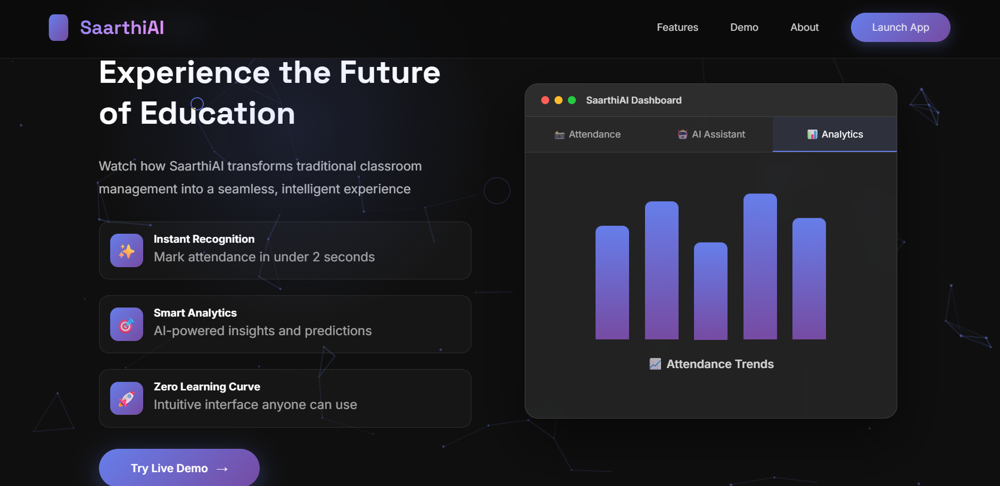

# 🎓 SaarthiAI - Smart Learning & Face Recognition Attendance System

An intelligent educational platform combining AI-powered learning assistance with automated face recognition attendance, designed specifically for schools and colleges.

## 🌟 Features

### 🤖 AI Learning Assistant
- Powered by Google Gemini AI
- Topic explanations in simple language
- Quiz generation for practice
- Flashcard creation for revision
- Interactive chat interface

### 📸 Face Recognition Attendance
- Automated student identification
- One-time face registration
- Real-time attendance marking
- Manual attendance backup option

### 👥 Multi-User Platform
- **Admin Dashboard**: User management, system analytics
- **Teacher Portal**: Course management, attendance tracking
- **Student Portal**: AI tutor access, attendance tracking
- **Parent Portal**: Child monitoring, fee tracking

## 🚀 Quick Start

### Prerequisites
- Python 3.8 or higher
- Webcam (for face recognition)
- Google Gemini API Key (for AI features)

### Installation

1. **Navigate to project folder**
```bash
cd saarthi-ai
```

2. **Create virtual environment**
```bash
python -m venv venv

# Activate
# Windows:
venv\Scripts\activate
# Mac/Linux:
source venv/bin/activate
```

3. **Install dependencies**
```bash
pip install -r requirements.txt
```

4. **Initialize database**
```bash
python database/db_utils.py
```

5. **Configure environment**
```bash
# Copy .env.example to .env
copy .env.example .env  # Windows
cp .env.example .env    # Mac/Linux

# Edit .env and add your Gemini API key
# Get key from: https://makersuite.google.com/app/apikey
```

6. **Run the application**
```bash
python app.py
```

7. **Access the application**
```
Open browser: http://localhost:5000
```

## 🔑 Default Login Credentials

| Role    | Username  | Password    |
|---------|-----------|-------------|
| Admin   | admin     | admin123    |
| Teacher | teacher1  | teacher123  |
| Student | student1  | student123  |
| Parent  | parent1   | parent123   |

## 📁 Project Structure
```
saarthi-ai/
├── app.py                      # Main Flask application
├── requirements.txt            # Python dependencies
├── setup.py                    # Setup automation script
├── .env                        # Environment configuration
├── database/
│   ├── db_utils.py            # Database utilities
│   └── saarthi.db             # SQLite database
├── face_recognition/
│   ├── recognizer.py          # Face recognition logic
│   └── models/                # Trained face models
├── ai_assistant/
│   └── gemini_helper.py       # Gemini AI integration
├── templates/                  # HTML templates
│   ├── index.html
│   ├── login.html
│   ├── admin/
│   ├── teacher/
│   ├── student/
│   ├── parent/
│   └── errors/
├── static/                     # Static files
│   ├── css/
│   ├── js/
│   └── images/
└── config/
    └── credentials.json        # OAuth credentials
```

## 🛠️ Technology Stack

- **Backend**: Flask (Python)
- **Database**: SQLite
- **Face Recognition**: OpenCV + Custom Algorithm
- **AI**: Google Gemini API
- **Frontend**: HTML, CSS, JavaScript
- **Authentication**: Session-based

## 📖 Usage Guide

### For Teachers
1. Login with teacher credentials
2. Navigate to "Take Attendance"
3. Start camera and scan student faces
4. System automatically marks attendance
5. View attendance reports and analytics

### For Students
1. Login with student credentials
2. Access AI Assistant for homework help
3. View attendance and course information
4. Track academic progress

### For Parents
1. Login with parent credentials
2. Monitor child's attendance
3. View fee payment status
4. Check upcoming events and announcements

## 🔧 Configuration

### Google Gemini API Setup
1. Visit https://makersuite.google.com/app/apikey
2. Create a new API key
3. Add to `.env` file:
```
   GEMINI_API_KEY=your_api_key_here
```

### Face Recognition
- First-time students need to register their face
- Registration requires clear face visibility
- Multiple angles can be registered for better accuracy

## 🐛 Troubleshooting

### Camera Not Working
- Ensure browser has camera permissions
- Check if other applications are using camera
- Try different browser

### AI Assistant Not Responding
- Verify GEMINI_API_KEY in .env file
- Check internet connection
- Ensure API key is valid

### Database Errors
- Re-initialize database: `python database/db_utils.py`
- Check database file permissions

## 📝 License

This project is created for educational purposes.

## 🤝 Support

For issues or questions:
- Check documentation
- Review troubleshooting guide
- Contact system administrator

## 🎯 Future Enhancements

- [ ] Multi-language support
- [ ] SMS/Email notifications
- [ ] Advanced analytics and reporting
- [ ] Mobile app development
- [ ] Biometric integration
- [ ] Online exam module

---
## 📸 Screenshots

### 🏁 Starting Page


---

### 🔐 Login Page


---

### 📊 Dashboard


---

### ⭐ Features


---

### 🤖 AI Tutor Assistance


---

### 📸 Face Recognition Attendance


---

### 👨‍👩‍👧 Parent Page


---

### 📈 Parent Dashboard

